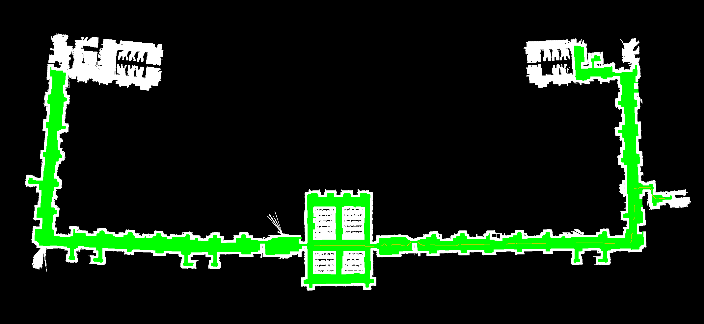

# SimplePlanner
A ROS2-integrated Dijkstra-based planner that computes the path to a user selected goal from the current location of a differential wheeled robot. The search algorithm aims to keep the robot as far as possible from walls.
<div align="center">  </div> </br>

In the **_src_** folder the three main packages are:
- [**_simple_planner_**](src/simple_planner/) : contains the core of the project. Here you can find the definition of the _simple_planner_ node and the search algorithms.
- [**_configuration_**](src/configuration/) : launch file, rviz settings and configuration files about the navigation stack nodes are stored here.
- [**_worlds_**](src/worlds/) : contains the data about the map and the robot used in the simulation. The original source is [this](https://gitlab.com/grisetti/robotprogramming_2023_24). 

# How it works

1. The [**_simple_planner_**](src/simple_planner/src/simple_planner.cpp) node listens to the **_map_** topic published by the **_map_server_** as a _nav_msgs/msg/OccupancyGrid_ message. 
2. A costmap (actually a _distance map_) is computed starting from the just obtained Occupancy Grid. It contains the distance of each cell from the nearest obstacle. The search [algorithm](src/simple_planner/src/distance_map.cpp) in this case is a simple BFS with all the obstacle cells in the frontier.
3. Once a **_goal_pose_** (in the format of a _geometry_msgs/msg/PoseStamped_ message) is received:
    
    - a _lookupTransform_ is executed to get the robot current pose;
    - the Dijkstra-based [planning algorithm](src/simple_planner/src/search.cpp) is executed using the distance map to compute the cost of a node;
    - the path is stored as a _nav_msg/msg/Path_ message.
4. The updated **_path_** topic is published.


# Setup
Ubuntu 22.04 + ROS2 humble
## Installation of the [stage_ros2](https://github.com/tuw-robotics/stage_ros2) package:

Follow the [instructions](https://github.com/tuw-robotics/stage_ros2/blob/humble/res/install.md) on their repository.

# How to Compile
From the project root:
```bash
colcon build
```

# How to Run
From the project root:
```bash
source install/local_setup.bash
ros2 launch src/configuration/launch/launch_all.xml
```

Otherwise, after the `source install/local_setup.bash` command, run each node individually.
<details>
<summary>Click here to expand and see all the commands.</summary>
  
## Visualization
```bash
ros2 run rviz2 rviz2 -d src/configuration/src/visualization.rviz
```
  
## Simulator
```bash
ros2 run stage_ros2 stage_ros2 --ros-args -p world_file:=src/worlds/src/cappero/cappero_laser_odom_diag.world
```

## Keyboard controller
```bash
ros2 run teleop_twist_keyboard teleop_twist_keyboard
```
It publishes _geometry_msgs/msg/Twist_ messages in the **_cmd_vel_** topic.

## Map Server
```bash
ros2 run nav2_map_server map_server --ros-args -p yaml_filename:=src/worlds/src/cappero/cappero_laser_odom_diag.yaml
ros2 run nav2_util lifecycle_bringup map_server
```

## Localizer
```bash
ros2 run nav2_amcl amcl --ros-args --params-file src/configuration/src/amcl.yaml
ros2 run nav2_util lifecycle_bringup amcl
```
## Planner
```bash
ros2 run simple_planner simple_planner
```

</details>
</br>


# How to Test
On rviz:

1) Set the 2D Pose Estimate
2) Set the 2D Goal Pose

If the selected Goal Pose can be reached from the current robot position, a path will be visualized (like in the [first image](#simpleplanner)).

Visualizations of the distance_map and the visited cells of the map are also saved. 

<div align="center">  Distance Map </div>
</br>
<div align="center">  Visited cells (in green) </div>


